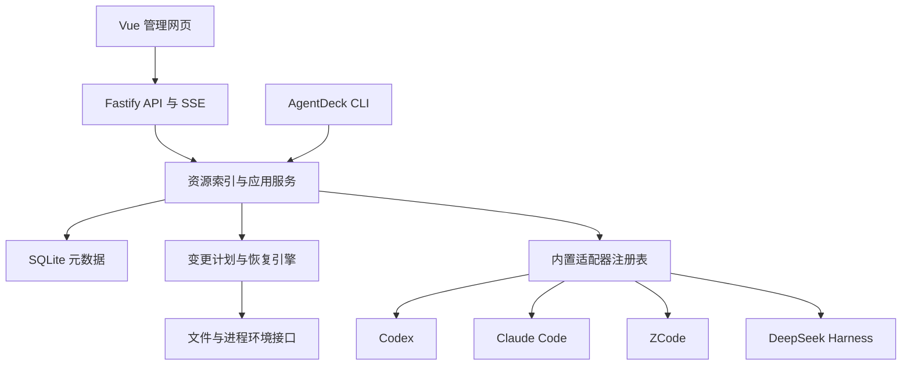

# AgentDeck 本地 Agent 扩展管理器：实施方案

方案版本：1.2。设计及更新日期：2026-10-02（Asia/Hong_Kong）。项目名称 AgentDeck。此次修订按用户决定收窄初期目标；保留完整设计供后续参考，不要求初期版本完成全部路线。

这是一份包含初期范围与后续设计的方案；当前已实现的预览范围及验证证据见《首轮交付记录》和《客户端兼容与原生验收》。初期用 Windows 本地 Vue 网页查看并管理已有 MCP、插件和 Skill；具体可写能力逐项验证，暂不能控制的资源明确只读。后文超出第 1.1 节初期范围的设计均延期，不构成初期交付门槛。

## 1. 产品目标与发布范围

用户可以看到本机有哪些 Agent、每个项目加载哪些扩展、扩展从哪里来、为什么未生效，并可靠地修改其启用状态。相同资源可以配置到多个客户端，各自保留独立状态。

### 1.1 发布分层

**当前执行范围：初期基础版（v0.1）。** 不再按原完整路线推进全部功能后才交付。保留已有成果和安全校验，不为未来功能提前重构；按下面基础验收收尾。原 v0.2/v0.3/v1.0 和 S0–S6 作为后续路线参考，尚无排期。

| 初期必须交付 | 验收边界 |
| --- | --- |
| 查看已有资源 | 发现或手动登记配置来源；查看 MCP、插件、Skill 的名称、来源、实例/项目范围及配置状态；区分插件组件和独立资源；缺失、未知和只读原因明确 |
| 基础筛选与刷新 | 按实例、项目、类型、来源查询，手动重新扫描；保留已有三维筛选，不要求推断跨客户端 Skill 兼容性 |
| 有依据的单项启停 | 对已验证原生控制方式逐项开放；没有原生开关或未验收的资源只读，不通过移动、删除原文模拟停用。Codex 用户级独立 MCP 保留用户明确批准的实验性策略，包括 HTTP/未知传输；该许可不扩大原生 verified 证据 |
| 可靠修改与恢复 | 修改前预览，应用前检查摘要、路径和结构；先备份，保存操作历史；可生成恢复计划，外部编辑冲突不覆盖 |
| 本地可运行 | 开发与生产启动可用，生产服务直接提供网页；保留鉴权、CSRF、Host/Origin 和脱敏；简明启动、支持范围与恢复说明 |

初期允许客户端和资源之间能力不齐：四适配器保留当前有限只读扫描，缺失客户端明确说明；不要求四客户端所有 Skill/插件/MCP 都有开关，也不要求完整发行矩阵或运行时观察。新增开关必须通过隔离配置的计划、应用、复读和恢复验收；所有写入验收只用隔离目录，真实配置验收保持只读。

**初期不实现：** 场景组合与批量分发、Skill 导入/副本/共享部署和原文编辑、跨客户端格式转换、MCP 握手/连接诊断与运行状态探测、插件安装/更新/卸载、账号管理；完整配置优先级模型、Deployment/共享源反向索引、增量监听扫描、分页/虚拟滚动、通用 HostAccess 重构、异步任务取消/持久重连和完整 CLI IPC；1000 资源性能专项、独立安装器/自动更新、Electron/托盘、macOS/Linux/WSL、第三方 SDK。遇到妨碍基础功能的实际问题仍应修复。

以下表格是延期的完整路线，不是初期必交清单：

| 发布 | 必须交付 | 完成标准 |
|---|---|---|
| v0.1 | 四种客户端的发现和只读资源扫描、项目登记、来源与配置层展示 | 不写入客户端配置；缺失和不支持的资源有明确原因 |
| v0.2 | 经验证的原生启停、变更预览、备份、恢复、操作日志 | 每个开放的写入能力都有原生配置样例和恢复测试 |
| v0.3 | 场景组合、跨客户端 Skill/MCP 分发、主动 MCP 诊断 | 部分不兼容可定位；重试不会重复修改；诊断进程可靠退出 |
| v1.0 | 上述功能稳定、Windows 本地网页分发、完整能力矩阵和使用文档 | 四种客户端均完成实际版本验收；未验证能力保持只读 |
| v1.1+ | Electron 桌面版、macOS/Linux、WSL 内运行模式、原生安装更新适配 | 各平台独立验收，不沿用 Windows 测试结论 |

首发优先 Windows 10/11 x64；代码保留跨平台接口。Windows ARM、跨 Windows/WSL 管理、SSH 和云端账号管理不属于首发承诺。安装了 WSL 客户端时，先提示在对应 WSL 环境运行管理器，不直接改写其 Linux 配置。

v1.0 管理扩展和配置。运行 Agent 任务、聚合聊天历史、费用统计、模型路由、自动后台更新和公开插件市场另列后续需求，避免影响核心交付。

### 1.2 用户场景

初期执行下面第 1、2、3、5 项；第 4 项场景组合延期。初期手动登记以配置目录为入口，不新增任意可执行文件登记能力。

1. 打开应用，发现 Agent 实例；发现失败时手动登记可执行文件或配置目录。
2. 登记一个项目，按客户端和作用范围查看 Skill、插件、MCP。
3. 将某个扩展停用，查看影响、应用、确认配置状态及生效要求。
4. 保存“代码开发”“文档工作”等组合；先预览再应用到选定实例和项目。
5. 修改失败或结果不合适时，从操作记录创建恢复计划。

## 2. 技术决策

| 项目 | 决定 | 取舍 |
|---|---|---|
| 前端 | Vue 3 + TypeScript + Vite，Composition API，script setup | 适合管理表格与配置表单；无需 SSR |
| UI | Element Plus，统一主题 token | 首版重视表格、树、抽屉、表单；不同时引入第二套 UI 库 |
| 状态 | Pinia + 普通 API composables | Pinia 保存选中实例、项目与筛选；后台资源以 API 为准 |
| 本地服务 | Node.js 24 LTS + TypeScript + Fastify | 前后端共享契约，适合文件和子进程操作 |
| 校验 | Zod 作为请求/领域契约；显式 DTO | 不把后台原始配置直接返回前端 |
| 数据 | SQLite + better-sqlite3，SQL migrations | 单机存储，无需外部数据库；同步访问只做短事务 |
| 事件 | SSE，数据库持久化重要事件 | 扫描进度与操作状态单向推送，暂不需要 WebSocket |
| 工程 | pnpm workspace，ESM，strict TypeScript | 共享类型、适配器 SDK、核心和测试夹具 |
| 测试 | Vitest + Playwright | 重点验证实际配置读写与用户操作流程 |
| 桌面 | 后续 Electron，网页 UI 和核心继续复用 | 独立的后台进程负责管理操作，UI 不直接操作文件 |

Node.js 24 在设计日为 LTS；构建时固定具体补丁版本并记录工具链。[Node.js 发布表](https://nodejs.org/en/about/previous-releases)

Vue 与 Fastify 的 TypeScript 用法见官方文档；Element Plus 按官方方式安装。[Vue](https://vuejs.org/guide/typescript/overview.html)、[Fastify](https://fastify.dev/docs/latest/Reference/TypeScript/)、[Element Plus](https://element-plus.org/en-US/guide/installation.html)

不在方案里猜测各依赖的最新小版本。初始化时选兼容的稳定版本，固定 packageManager、Node 版本和 pnpm-lock.yaml，CI 使用 frozen-lockfile。升级通过单独任务和兼容测试进入。

配置编辑工具选择：JSON 用 jsonc-parser 做定点修改；YAML 用 yaml 的 Document/CST 能力；TOML 优先实现已支持字段的语法定位编辑器，并用独立 TOML 解析器交叉验证。任何无法保留语法和未知字段的文件降级只读，不用正则全文件替换，也不解析后整体重写。

## 3. 总体架构与工程结构



采用模块化单体，一个本地后台进程。依赖方向为 UI/API → 应用服务 → 核心契约；适配器实现契约，通过受控文件/进程接口访问客户端。核心不引用 Fastify 和 Vue，适配器不直接连接数据库。

```text
agentdeck/
  apps/
    web/                 Vue 页面、组件、API client
    server/              API、认证、SSE、启动与静态资源服务
    cli/                 serve、scan、doctor、plan、apply、restore
    desktop/             v1.1 再创建 Electron 外壳
  packages/
    contracts/           DTO、Zod schemas、错误码、事件定义
    core/                实例、索引、组合、分发、变更与恢复服务
    adapter-sdk/         AgentAdapter、HostAccess、配置层与能力契约
    adapters/
      codex/
      claude-code/
      zcode/
      deepseek-harness/
    config-edit/         JSON/YAML/TOML 定点编辑与原始文档模型
    host-local/          Windows/macOS/Linux 文件和进程实现
    storage/             SQLite repositories、迁移
    diagnostics/         静态检测、MCP probe、脱敏
    test-support/        临时 HOME、假 CLI、故障注入
  fixtures/              去凭据的客户端真实配置与预期结果
  docs/                  设计、版本兼容矩阵、运行和恢复说明
```

首版适配器由项目内代码注册。第三方适配器 SDK 后续公开；v1.0 不从互联网自动加载和执行适配器代码。

## 4. 核心数据模型

### 4.1 实体与身份

| 实体 | 核心字段 | 说明 |
|---|---|---|
| Environment | id、kind、platform、home、pathStyle | 首版为本地操作系统；预留 WSL 环境 |
| AgentInstance | id、adapterId、distribution、version、executable、configRoot、environmentId、profile | 一个已识别的客户端配置实例 |
| Project | id、environmentId、rootPath、realPath、displayName | 显式登记，不扫描整个磁盘 |
| Resource | id、kind、nativeKind、name、source、version、contentDigest、skillMetadata | Skill、插件、MCP 的资源身份；Skill 元数据包含来源、依赖与兼容证据 |
| Binding | id、resourceId、instanceId、projectId、scope、scopeKey、nativeScope、parentBindingId、locator、state | 资源在某实例/范围中的配置；保留原生层与实际作用边界 |
| Deployment | id、resourceId、bindingId、sourceDigest、deployedDigest、targetRealPath、storageMode、ownership | 分发记录、共享原文/副本关系和可撤销归属 |
| ConfigLayer | id、instanceId、projectId、origin、precedence、writable、digest | 原生配置层及覆盖关系 |
| ChangePlan | id、requestDigest、revision、expiresAt、steps、preconditions、effects | 可验证、可审阅的修改计划 |
| Operation | id、planId、status、startedAt、finishedAt、result | 执行、恢复与失败记录 |
| Preset | id、schemaVersion、name、rules、targets | 用户保存的场景组合 |

Resource 不承载通用 enabled 字段。启用状态属于 Binding。

Skill 名称相同不足以证明是同一资源。优先使用来源地址+相对路径；无法建立来源时生成本地身份。内容摘要用于比较版本，不作为永久主键。同一插件在不同市场中的条目保留独立身份。MCP 同名或同 URL 不自动合并，提供“可能相同”的手动关联提示。

Binding 唯一键：instanceId + scopeKey + native locator key。scopeKey 明确包含全局实例、项目根、子目录 realpath 或未来的会话身份，避免子目录资源被错误合并。DSH locator 额外包含 profile、include path、完整 row id 和模块身份。Windows 大小写比较、符号链接 realpath 和显示路径分别保留。

同一个 .agents/skills 目录可能被多个客户端读取。索引维护 realpath → 全部受影响 Binding 的反向关系；编辑共享原文或撤销共享目录中的部署时，计划必须列出其他实例的影响，执行后全部失效并重扫。单个客户端的原生开关仍写该客户端自己的配置。DSH profile 级变更显示“影响使用该 profile 的全部会话”，不能包装成只影响所选项目。

### 4.2 状态分解

```ts
type DesiredState = 'inherit' | 'enabled' | 'disabled';
type EffectiveState = 'enabled' | 'disabled' | 'unknown';
type RuntimeState = 'active' | 'inactive' | 'pending' | 'unknown';
type Availability = 'ready' | 'missing-auth' | 'missing-dependency'
  | 'invalid-config' | 'unreachable' | 'unknown';
type ApplicationMode = 'hot-reload' | 'new-session' | 'restart' | 'unknown';

interface BindingState {
  installed: boolean | null;
  desired: DesiredState;
  effective: EffectiveState;
  runtime: RuntimeState;
  availability: Availability;
  checkedAt: string;
  evidence: { source: string; detail: string; observedAt: string }[];
}
```

状态示例：“配置已启用 / 待新会话 / 未检测连接”，避免用绿色开关代替全部状态。静态推导可以确认 effective；只有明确的运行时证据能确认 active。一次管理器 MCP probe 成功不能证明 Agent 当前会话已经加载。

### 4.3 存储原则

原生配置决定实际状态。SQLite 保存索引、用户标签、Preset、计划和历史，不把数据库的旧值自动覆盖回客户端。

主要表：environments、agent_instances、projects、resources、skill_metadata、skill_compatibility_reports、bindings、deployments、config_layers、presets、preset_rules、change_plans、operations、operation_steps、snapshots、diagnostics、events、settings。外键启用；SQLite WAL、busy timeout、schema_version migrations；写事务短小，不在数据库事务中执行 CLI 或等待网络。

不保存完整原始配置到普通索引表。配置原文按需读取，计划明文 diff 对外脱敏。真实文件快照另存受访问控制的恢复目录，数据库只记录路径与摘要。

### 4.4 Skill 的三个分类维度

采用“作用范围 × 客户端适用性 × 来源”三个独立维度。一条 Skill 可以同时是“项目级 / Claude Code 专用 / 项目仓库提供”；列表标签可组合，不设互斥的全局类、项目类、Agent 类总枚举。

#### A. 作用范围：属于 Binding

| 范围 | 内部值 | 必要上下文 | 界面含义与交付边界 |
|---|---|---|---|
| 用户全局 | user-global | instanceId、environmentId | 对某个客户端实例的用户全局配置生效；不等于所有 Agent 共用 |
| 项目级 | project | projectId、项目根 | 在该客户端和项目上下文内有效；是否覆盖全局由适配器判断 |
| 项目子目录级 | project-directory | projectId、目录 realpath | 客户端支持时按扫描/加载规则识别；不支持时不给出伪造的子目录开关 |
| 会话临时级 | session | instanceId、sessionId | v1.0 预留契约；后续仅通过受支持的启动/会话接口提供 |
| 原生特殊范围 | native | nativeScope、实际边界说明 | 保留 profile、组织层或其他无法等价映射的原生范围，不强行称为项目级 |

每个 Binding 同时记录 discoveryScope（原文被发现的位置）和 controlScope（修改开关的目标配置层）。例如仓库提供的 Skill，可能由当前用户的项目个人配置控制。改变开关作用域不改变原文来源，也不移动 Skill。

“用户全局”仅表明上下文范围；“全局共享”另外由 storageMode 和适用客户端共同描述。子目录向上查找和父项目继承按客户端原生规则展示来源链，不统一假定最近目录一定覆盖父目录。

#### B. 客户端适用性：属于 Skill 元数据与兼容报告

| 分类 | 内部值 | 判定与行为 |
|---|---|---|
| 跨 Agent 通用 | portable | 有显式声明或检查证据表明内容可移植；部署时仍逐目标做依赖检查 |
| Agent 专用 | agent-specific | 依赖指定客户端的工具、语法、命名空间或执行流程；记录目标 adapterId |
| 部分兼容 | conditional | 部分客户端可用，或需要字段转换、工具映射、依赖补充 |
| 尚未判断 | unknown | 没有足够证据；显示未验证，不自动宣传为所有 Agent 通用 |

compatibilityClass 是汇总标签；决定能否部署的是 targetReports，按 adapterId、客户端版本、环境、contentDigest 保存 compatible / needs-conversion / incompatible / unknown 及原因。声明、静态检查和实际验证分别标记 evidenceType，用户标签不代替技术证据。

文件内容、相关依赖或客户端版本改变时，旧报告标记 stale 并重新检查。识别为 portable 不代表脚本能跨操作系统运行，也不代表正文引用的 MCP 工具在目标客户端已连接。扫描不通过执行 Skill 或付费模型调用来推断兼容性。

#### C. 来源：属于 Skill 元数据与来源链

| 来源标签 | 内部值 | 典型管理方式 |
|---|---|---|
| 用户自建/导入 | user | 原文可编辑性与目录权限、归属独立判断 |
| 项目仓库提供 | repository | 显示仓库与相对路径；编辑原文提示团队/共享影响 |
| 插件附带 | plugin | 记录 parentBindingId 和原生插件身份；子项开关遵循适配器能力 |
| Agent 内置 | builtin | 显示客户端及版本；原文一般只读，原生覆盖能力另行判断 |
| 组织管理 | organization | 显示组织配置来源与管理限制，不自行修改下发内容 |
| 账号同步 | account-sync | 显示同步来源，避免用删除本地缓存模拟停用 |
| 来源未知 | unknown | 保留可确认路径和证据，不推测提供方 |

sourceKind 取最直接的提供入口，provenance 保存多层来源链；例如组织下发的插件 Skill 可记录 plugin → organization。组织约束、同步归属、系统目录和用户权限单独进入 managementPolicy，不依赖单一来源标签判断能否编辑。

### 4.5 分类契约、归属与共享方式

```ts
interface SkillMetadata {
  sourceKind: 'user' | 'repository' | 'plugin' | 'builtin'
    | 'organization' | 'account-sync' | 'unknown';
  provenance: { kind: string; reference: string }[];
  compatibilityClass: 'portable' | 'agent-specific' | 'conditional' | 'unknown';
  declaredAgentIds: string[];
  requirements: { kind: 'tool' | 'mcp' | 'runtime' | 'os' | 'file'; value: string }[];
  targetReportIds: string[];
}

interface SkillBindingContext {
  discoveryScope: 'user-global' | 'project' | 'project-directory' | 'session' | 'native';
  scopeKey: string;
  nativeScope: string;
  controlScopeOptions: string[];
  directoryPath?: string;
  sessionId?: string;
  managementPolicy: { managed: boolean; writable: boolean; reason?: string };
}

type SkillStorageMode = 'independent-copy' | 'shared-source' | 'shared-link';
type DeploymentOwnership = 'agentdeck' | 'external' | 'managed' | 'synced';
```

三个主筛选维度之外，storageMode 与 ownership 是管理属性。独立副本可分别更新；shared-source 是多个客户端读同一原文；shared-link 是不同发现入口经链接指向同一原文。只有 agentdeck 归属且目标摘要仍匹配的副本能自动撤销部署，不能因“用户自建”标签就删除文件。

Skill 元数据存放在管理器数据库，不为了增加分类标签擅自修改 SKILL.md frontmatter。手动更改分类记录标记 declared，并保留扫描证据；实际范围、管理权限及客户端能力仍由原生配置推导。

示例：同一 portable Skill 在 Codex 的用户全局目录和 Claude Code 的项目目录各部署一个副本，保留一个逻辑资源与两条 Deployment/Binding；两个开关互不影响。若二者实际读取同一共享原文，编辑/撤销的影响计划必须同时列出两条 Binding。

## 5. 适配器契约与版本管理

```ts
interface AgentAdapter {
  id: string;
  discover(host: HostAccess): Promise<DiscoveryResult>;
  inspect(instance: AgentInstance, host: HostAccess): Promise<InstanceReport>;
  resolveLayers(context: AgentContext): Promise<ConfigLayerReport>;
  scan(context: AgentContext): Promise<ScanReport>;
  capabilities(context: AgentContext, binding?: Binding): CapabilityReport;
  plan(context: AgentContext, request: ChangeRequest): Promise<ChangePlanDraft>;
  verify(context: AgentContext, result: StepResult[]): Promise<VerificationReport>;
}
```

所有参数和返回值在 adapter-sdk 定义；执行计划由核心引擎统一处理，不让适配器自行绕过快照和日志。适配器提供允许的命令操作和编辑策略，HostAccess 限制访问范围。

CapabilityReport 是按版本、资源类型、作用域细分的操作矩阵，不是全局 canToggle。每项含 supported、strategy、applicationMode、readOnlyReason、requiresProject、evidenceId。操作包含 inspect、set-enabled、set-disabled、clear-override、edit、deploy、remove、install、update。

Skill 适配器另外提供可发现范围、可控制范围、原生可见状态、兼容字段和来源证据。用户全局/项目/子目录等范围必须与客户端版本能力相匹配；用户修改分类或选择 Agent 专用标签不会开放原本不支持的写操作。

`clear-override` 恢复继承，不能被“enabled=true”替代；上层禁用或组织限制可能阻止启用。

版本兼容矩阵记录 distribution、exactVersionsTested、supportedRange、fixtureRevision、readFeatures、writeFeatures。每个开放写入能力必须有实测证据。未知发行版或超过验证范围时允许扫描，写入降级只读；检测命令存在不等于验证语义。

## 6. 四个客户端的接入策略

下述原生依据来自设计日公开文档。它们不是对本机安装版本的验证；T02 开发任务负责收集本机版本并固化夹具。

### 6.1 Codex

发现候选 CLI 与配置根目录，识别 CODEX_HOME 等有效环境覆盖。读取用户与受信任项目配置，并展示组织/系统约束能读取到的部分。Skill 扫描包括适配器版本支持的用户、仓库、系统和插件路径；缓存资源标注来源。

原生启停采用 skills.config、mcp_servers.<id>.enabled、plugins.<plugin>.enabled 与插件内 mcp_servers 设置。本地市场插件与组织管理插件区别对待。Skill path 按所测版本接受的规范形式写入；不依靠删除目录停用。资料见 [Skill 文档](https://learn.chatgpt.com/docs/build-skills) 与 [配置参考](https://learn.chatgpt.com/docs/config-file/config-reference)。

首批写入：用户独立 Skill、独立 MCP、本地市场插件、插件内 MCP。未验证的内置 Skill 和组织管理条目只读。修改后先验证有效配置，按客户端要求显示重启或新会话；不自动关闭用户正在运行的聊天。

### 6.2 Claude Code

识别 CLAUDE_CONFIG_DIR 等目录覆盖；设置文件、用户状态文件和项目 MCP 文件分别建立 ConfigLayer，不把 MCP 写入普通 settings 的错误位置。作用域解析参考 [设置文件说明](https://code.claude.com/docs/en/settings) 与 [MCP 文档](https://code.claude.com/docs/en/mcp)。

独立 Skill：经版本验证后用 skillOverrides 的 on/off/继承实现；保留 name-only、user-invocable-only 等原生状态。插件 Skill 不适用该字段，提供父插件操作入口。相同 Skill 名称产生多绑定时，计划必须显示一次名字级覆盖会影响的全部对象。[Skill 覆盖说明](https://code.claude.com/docs/en/skills#override-skill-visibility-from-settings)

插件：优先使用原生 plugin enable/disable，明确 --scope，并对依赖变化生成预览；CLI 的“已经处于目标状态”结果经复读验证后视为幂等成功。不能仅凭退出码 1 判失败，也不能忽略其他错误。[插件命令参考](https://code.claude.com/docs/en/plugins/cli-reference)

MCP：原生 per-project disabledMcpServers 是停用机制；项目 .mcp.json 的批准设置是另一机制，禁止混用。只对已经验证的原生 key 做定点编辑；默认不设置未经证实的全局停用字段。插件 MCP 用客户端解析后的完整身份，避免误停同名服务器。

### 6.3 ZCode

默认目标为 zai-org/ZCode 官方 CLI。识别发行来源与版本，不能将其他同名 zcode 项目的配置套用到本机。候选配置为 ~/.zcode/cli/config.json；独立 MCP 使用 mcp.servers.<id>.enabled；插件启停优先原生 zcode plugins enable/disable。[官方 CLI README](https://github.com/zai-org/ZCode/blob/main/apps/zcode-cli/README.md)

插件解析 .zcode-plugin/plugin.json 与其 MCP 声明，保留插件原生变量。禁止将未解析的占位符误报为可连接配置。独立 Skill 的扫描根目录、逐项开关和插件子组件能力先通过对应版本源码/CLI 确认；未确认的写入保持只读。

### 6.4 DeepSeek Harness

区分安装根目录、DSH_HOME、profile、bundle 和插件 entry。插件是可执行运行时组件，不等同于 Codex 的资源包。profile、home、调用覆盖和 include 边界由 DSH 专用解析器处理。[官方架构](https://github.com/deepseek-ai/deepseek-harness/blob/master/docs/architecture.md)

独立 MCP 是 dsh-mcp-client 插件条目；Skill 来源用 filesystem provider 根目录规则解析。[MCP 配置](https://github.com/deepseek-ai/deepseek-harness/blob/master/packages/mcp/mcp-client/README.md)、[Skill provider](https://github.com/deepseek-ai/deepseek-harness/blob/master/packages/skill/skill-filesystem/README.md)

profile 插件启停以官方 manager 的覆盖语义为依据：定点调整对应 profile patch 的 disabled，必要时追加覆盖；bundle 选择与普通 row 启停分别实现。agent-preset、不可唯一定位、管理必需和当前 manager 标记只读的节点不开放修改。默认不注册额外 DSH 插件；后续有受支持接口时再加入可选桥接。[官方 Plugin Manager](https://github.com/deepseek-ai/deepseek-harness/blob/master/packages/boot/plugin-manager/README.md)

静态读取 YAML 保留 !!js、自定义标签、锚点和表达式，不执行表达式，涉及动态 disabled 时有效状态设 unknown。HMR 取决于 profile；没有运行时证据时只报告配置保存和待重载。[启动与配置说明](https://github.com/deepseek-ai/deepseek-harness/blob/master/packages/boot/app-boot/README.md)

DSH 的逐项外部 Skill 停用暂不假设存在。支持 manager-owned Skill 副本分发与撤销；外部 Skill 原文只读，待确认原生控制能力后开放。绝不为了一个 Skill 随意关闭共享 provider。

### 6.5 没有原生开关时的处理

采用“能力受限”状态，并说明可操作的父资源。对 AgentDeck 新部署且拥有的副本，可用完整复制/撤销部署来控制发现；只删除摘要未变化且仍归本管理器所有的副本。用户手工创建、组织下发、共享、同步、插件缓存中的资源不自动移动。

不要把 disable-model-invocation、限制工具调用、隐藏菜单和完全停用混称一个行为。UI 用原生准确名称；通用停用只映射到已验证的等价语义。

## 7. 扫描和索引流程

1. 发现可执行文件、已有配置目录和用户登记位置；带超时执行已知的版本/帮助命令，不启动聊天或模型请求。
2. 通过适配器解析有效配置根目录和来源；一个目录无 CLI 也可注册为 config-only 实例，命令操作不可用。
3. 扫描登记项目，遵循客户端仓库边界和路径规则；每个来源输出 source locator、摘要和只读原因。
4. 建立插件组件关系，解析启用状态与覆盖关系；发现失败保留上次结果并标 stale，不变成“全部卸载”。
5. 短事务替换成功扫描范围的索引，发布 resource.changed 和 scan.completed。

Skill 扫描同时生成三个分类维度：根据真实发现位置确定 discoveryScope，根据直接提供方和来源链确定 sourceKind，根据已有声明及静态证据构建兼容报告。未被安装的库内 Skill 不生成虚假的生效范围；有同名项时保留独立 Binding，并显示原生名字级覆盖实际会影响的集合。

已实现的只读扫描增强（参考 [TokenTracker 的 Skill 目录盘点](https://github.com/xiufengsun/TokenTracker/blob/36f31510b997de23838794a4cba4b087ae1ac7f3/src/lib/skills-manager.js)）：

1. 在已登记的 Skill 根目录内支持最多 3 层 Skill 目录、600 个候选目录的只读分组扫描，沿用每层条目上限和 `SKILL.md` 的 96 KiB 文件上限；跳过隐藏目录、符号链接和 junction，不越过已登记根目录。分组 Skill 以结构化 `discoveryOnly` 和相对 `discoveryPath` 标记，列表直接显示“仅磁盘发现”及分组路径；配置状态未知且保持只读，不能据此推断该客户端版本可见或当前会话已加载它。未来若要标成客户端可见，仍需逐客户端版本验证。
2. 从 `SKILL.md` frontmatter 仅读取用于展示的 `name`、`description`（frontmatter 上限 8 KiB）；解析失败或字段不安全时退回目录名及默认说明。展示名称单独存入 `displayName`，目录名 `name`、`nativeKey`、路径覆盖和写入目标不变；不执行正文、脚本、标签或引用，也不把描述文本当成可信指令。

上述增强仅属于静态发现，不改变运行状态证据。用隔离目录夹具覆盖直属/分组 Skill、重复名称、大小写、超深度、循环链接、越界链接、过大或畸形 frontmatter、插件缓存与客户端不支持分组目录的情况；验证扫描不修改来源，界面仍将会话加载显示为“暂未检测”。

仅 watch 已确认根目录。文件事件去抖默认 400ms，触发范围重扫；运行时可调。每次进入页面若索引过期则后台刷新，并提供手动刷新。符号链接记录目标、防止循环；不跟随路径到用户未登记范围执行写入。

配置原文按需读取，单文件默认上限 5MiB；超过时显示原因并允许调整读取限制。目录扫描有取消与文件数量上限，不阻塞整个实例。

## 8. 配置变更、恢复与幂等

### 8.1 计划生成

请求只描述意图：bindingId、action、targetScope、目标状态。后台重新读取文件，解析层和依赖，生成文件级步骤或原生 CLI 步骤。计划包括：

- 目标实例/项目/作用范围和影响的所有 Binding。
- 对 Skill 区分原文编辑、兼容副本部署、客户端开关、恢复继承和撤销部署；共享原文必须显示跨实例/项目影响，不能以分类标签缩小实际影响。
- 原始文件 SHA-256、是否原先不存在、配置 revision、客户端版本。
- 脱敏前后 diff、依赖变化、能力限制和生效条件。
- 各步骤可恢复性：exact-file、conditional-compensation、manual。

默认计划有效期 10 分钟。时间未过期也必须检查所有前置摘要；计划不能跨版本和目录变化复用。计划生成可以做静态检测，但不启动 MCP 服务、不安装包。

### 8.2 执行顺序

1. 校验 planDigest、revision、能力和 scope；按环境+realpath 排序获取写锁，避免死锁。
2. 再检查目标文件与符号链接，摘要变动则 409 CONFIG_CHANGED，保留用户最新编辑并要求重新规划。
3. 建立 operation 和 write-ahead journal；快照完成并同步磁盘后才修改目标。
4. 文件步骤写同目录临时文件，保留编码、换行、权限；使用平台支持的替换策略。Windows 文件占用只做有限重试，不强行删除锁住文件。
5. 每步后记录实际摘要和结果；验证语法、目标配置和未修改字段。未知是否执行成功的 CLI 步骤必须先复读状态再决定重试。
6. 重新扫描受影响来源，写入终态、发布事件，展示 saved/pending/verified 等结果。

单文件可做平台支持的原子替换；多文件、多个 CLI 和多个客户端不能承诺整体原子事务。默认按目标实例分组执行，失败则停止该组后续步骤；其他组是否继续由批量执行策略明确指定。结果呈现成功、失败、跳过和需恢复清单。

CLI 步骤必须声明预计影响的配置文件和依赖范围。无法限定文件范围、不能预览的安装/更新操作留到后续原生管理流程；不伪造完整文件事务保证。

### 8.3 恢复

恢复也是新计划。当前文件仍等于该操作实际写入的摘要，才能还原原始快照；若有后续用户修改，用三方差异提出恢复计划，不覆盖整文件。原先不存在的文件只有在完全由该操作创建且未被修改时才移除。

退出或崩溃时，启动恢复器读取 journal，通过 before/after/current 摘要判定哪一步实际完成；不自动重跑外部命令。配置已保存但运行时加载失败时，保留错误与状态，给出可审阅的恢复计划。

客户端 CLI 的补偿操作可能不能恢复缓存、安装脚本副作用和运行中会话；UI 显示准确可恢复范围。快照只覆盖配置和 manager-owned 副本，不备份整个客户端缓存或聊天历史。

## 9. 场景组合与跨客户端分发

本节全部延期，初期版本不实现；已有资源仍可只读展示来源。

### 9.1 Preset

首版采用 merge 策略：只修改组合显式列出的资源，其余保持当前配置。后续 exact 策略只能在用户选定、管理器可控资源集合内关闭未列出的条目。

组合规则用逻辑资源 ID/来源和各客户端映射，不保存不可移植的 Binding ID。缺失映射、受组织限制、同名歧义及不支持范围先报告，不能静默跳过。应用组合复用 ChangePlan。默认不自动安装组合中缺失的资源。

Skill 规则可指定目标 adapterId、targetScope 与项目/子目录目标；范围映射必须经适配器验证。首版用明确资源引用，筛选器结果用于挑选资源，不保存“停用所有全局 Skill”等随新资源出现而变化的隐式破坏规则。Agent 专用、来源未知和需转换资源均在预览中标明。

示例格式是 AgentDeck 自己的组合格式，不是任何客户端的原生配置：

```json
{
  "schemaVersion": 1,
  "name": "文档工作",
  "mode": "merge",
  "rules": [
    { "resourceRef": "library:document-helper", "state": "enabled" },
    { "resourceRef": "library:browser-tools", "state": "disabled" }
  ]
}
```

### 9.2 Skill 分发

从本地完整 Skill 目录导入，保存来源、文件摘要和版本，整体复制 references/assets/scripts。先检查目标客户端支持的 frontmatter 和命名空间；客户端特有字段需用户选择保留、转换或取消，并展示差异。正文提到的工具和路径另做依赖诊断。

默认复制而非符号链接，避免一个客户端修改影响全部副本。导入不执行 scripts。启用/撤销只操作 manager-owned 部署；副本被外部修改时标记 drift 并要求重新规划。

分发向导依次选择来源 Skill、目标 Agent 实例、支持的作用范围及目录，运行逐目标兼容检查，最后生成计划。无法独立控制的插件 Skill 优先指向父插件；“提取为独立 Skill”是显式新资源导入，保留来源链、完整资产和依赖诊断，不修改原插件。

共享链接不作为首版自动分发默认方式。已有共享原文/链接可以扫描和显示；未来主动创建共享部署时，必须展示潜在读取客户端和集中更新影响。不得通过改动共享目录来声称仅停用了一个 Agent 的 Skill。

### 9.3 MCP 分发

内部描述保留 transport、command、args、cwd、env references、URL、headers references、native extras。目标适配器负责转换支持字段；不支持的 SSE/HTTP/WS/OAuth 参数明确显示，不丢弃后继续。相对 cwd 必须解析后展示目标路径；环境变量和占位符按目标环境处理。

分发连接定义不复制 OAuth token；在目标客户端走原生登录流程。SecretRef 与原始字面值区别处理，默认导出引用和缺失提示。

### 9.4 插件

首版管理各客户端原生插件启停。跨客户端插件包不做直接复制：清单、市场身份、Hook、变量和运行时不等价。后续可提取经过兼容检查的 Skill/MCP 形成新的目标包，原插件保持完整。

## 10. MCP 诊断与进程边界

本节主动诊断延期，初期不握手或启动 MCP；已有静态扫描错误与只读原因继续展示。

分为静态检查和主动连接检测。静态检查验证配置、路径、依赖与变量引用，不启动任何资源。主动检测由用户点击发起：

1. 对 stdio 建立临时子进程；使用受控 argv、cwd 和最小必要环境。
2. 对受支持的 HTTP/SSE 用固定版本 MCP SDK 做 initialize 与 tools/list；读取元信息，不调用任意业务工具。
3. 默认连接超时 10 秒、整个检测 20 秒，可由实例策略调整。
4. 记录握手/协议/认证/超时/命令缺失错误；清理进程树和连接，用户取消也走清理。

即使不调用业务工具，启动服务也会执行其初始化代码；按钮文案明确“启动并检测连接”。OAuth 需求交给客户端登录入口，管理器不复用或逆向读取客户端 OAuth 缓存。

管理器只终止自己创建的诊断和后台进程，不按进程名杀掉用户 Agent 或 MCP。Windows 管理子进程采用 Job Object 或经过测试的进程树清理实现。

ProcessRunner 默认 shell=false、argv 数组、限时与输出上限。Windows .cmd shim 单独处理：识别已知 npm shim 并解析到 Node 入口；不能安全识别时禁用该命令能力并提示配置真实入口。禁止通过拼接用户字符串调用 cmd 或 PowerShell。

## 11. API、事件与 CLI

统一 API 前缀 /api/v1；所有读写需要本机会话认证。普通分页 cursor+limit；返回 requestId 和 scanRevision。

| 方法 | 路径 | 用途 |
|---|---|---|
| GET | /health | 只返回启动/版本状态，无本地路径 |
| GET | /api/v1/instances | 列出 Agent 实例 |
| POST | /api/v1/instances/discover | 异步发现任务 |
| POST | /api/v1/instances | 手动注册配置实例 |
| GET/POST | /api/v1/projects | 列出/登记项目 |
| POST | /api/v1/scans | 范围扫描，返回 operationId |
| GET | /api/v1/resources | 查询逻辑资源库，包含未部署 Skill |
| GET/PATCH | /api/v1/resources/:id/skill-metadata | 读取分类及证据；修改用户声明和标签，不修改原生原文 |
| POST | /api/v1/compatibility-checks | 针对资源与目标客户端生成静态兼容报告，不执行 Skill |
| GET | /api/v1/bindings | 按实例、项目、类型、状态及 Skill 三个分类维度筛选 |
| GET | /api/v1/bindings/:id | 资源详情、来源与能力 |
| GET | /api/v1/config-sources/:id | 脱敏配置，按允许范围读取 |
| POST | /api/v1/plans | 启停、编辑或部署的意图生成计划 |
| GET | /api/v1/plans/:id | 计划详情与脱敏 diff |
| POST | /api/v1/plans/:id/apply | 带 revision/digest/idempotencyKey 应用 |
| GET | /api/v1/operations/:id | 进度、结果与步骤 |
| POST | /api/v1/operations/:id/cancel | 取消可取消步骤 |
| POST | /api/v1/operations/:id/restore-plan | 生成恢复计划 |
| GET/POST/PATCH | /api/v1/presets[/id] | 场景组合管理 |
| POST | /api/v1/presets/:id/plan | 为选择的目标生成计划 |
| POST | /api/v1/diagnostics | 静态/主动诊断 |
| GET | /api/v1/events | SSE |

不得提供接收任意 shell 字符串的 execute 接口，或不受登记范围约束的任意路径 read/write 接口。计划中的原始内容在服务端保存，apply 只提交计划身份与摘要。

Skill 查询参数包括 discoveryScope、applicableAgentIds、compatibilityClass、sourceKind；其中 instanceId 选择实际配置实例，applicableAgentIds 筛选兼容报告/声明中的适用客户端，二者分开。高级筛选增加 nativeScope、ownership、storageMode、managed、compatibilityStatus。不同维度 AND，同一维度多选 OR。API 返回 scopeLabel、sourceLabel、compatibilitySummary、readOnlyReason 与证据摘要，前端不重新猜测分类。未部署资源从库资源接口查询，不能把资源级 source/compatibility 和 Binding 级范围混在同一全局开关中。

错误码：UNSUPPORTED_OPERATION、UNSUPPORTED_VERSION、CONFIG_CHANGED、AMBIGUOUS_TARGET、POLICY_LOCKED、DEPENDENCY_BLOCKED、INVALID_CONFIG、PATH_OUTSIDE_SCOPE、AUTH_REQUIRED、TIMEOUT、PARTIAL_FAILURE、RECOVERY_CONFLICT。DTO 包括用户可理解的 message、可恢复动作、脱敏 detail。

SSE envelope：id、type、operationId、instanceId、revision、timestamp、payload。事件含 scan.progress/completed、resource.changed、operation.progress/completed、diagnostic.completed。重要终态事件持久化；使用 Last-Event-ID 重连，过期游标发 reset 要求复读 API。高频进度合并，避免事件无限积累。

CLI 复用核心，交互命令名为规划目标，并非当前已安装命令：

```text
agentdeck serve --host 127.0.0.1 --port 0
agentdeck scan --instance <id> --project <id> --json
agentdeck doctor --instance <id> --json
agentdeck plan --binding <id> --state disabled --scope user --json
agentdeck apply --plan <id> --digest <sha256>
agentdeck restore --operation <id> --plan-only
```

运行后台时，CLI 写操作通过后台内部 API 执行；无后台时获取数据目录独占锁。CLI 通过仅当前用户可访问的本地 IPC（Windows named pipe；Unix domain socket）兑换一次性认证，不把服务认证 token 存在公开端口文件里。不能同时启动两个写入引擎。serve 端口 0 自动选择端口并打印实际地址；开发 Vite 与后台端口分离。

## 12. Vue 页面与交互

| 页面 | 主要内容 | 关键操作 |
|---|---|---|
| 总览 | 实例、资源数量、异常、最近操作 | 发现、刷新、诊断 |
| Agent 实例 | 版本、配置根、支持能力 | 登记、测试发现、查看范围 |
| 资源管理 | Skill/MCP/插件筛选、插件组件树 | 启停、详情、批量计划 |
| 跨 Agent 矩阵 | 行为资源、列为实例及选定项目 | 对比状态、分发兼容资源 |
| 项目配置 | 项目范围与来源覆盖链 | 明确全局/项目/本地修改 |
| 场景组合 | 规则、目标、缺失资源 | 编辑、预览、应用 |
| 操作记录 | 步骤、结果、快照、冲突 | 查看、恢复、重新规划 |
| 设置 | 数据目录、扫描根、诊断参数 | 维护和脱敏导出 |

全局工具栏选择实例、项目和目标范围。资源行显示原生名称、类型、所属插件、来源层、配置状态、生效状态、可用性。插件节点先展示整包开关，子组件根据能力独立操作。

Skill 页提供三个主筛选器：“作用范围”“适用 Agent”“来源”；行内展示范围、兼容性和来源标签。适用 Agent 可多选，额外显示通用/专用/部分兼容/未验证状态。高级筛选提供独立副本/共享原文/共享链接、归属和只读状态。默认显示当前实例和项目可见的 Binding，切换“资源库”查看尚未部署的 Skill。

Skill 详情抽屉包含：完整来源链、发现范围与可修改配置层、适用客户端及版本证据、工具/运行时依赖、插件父资源、共享原文或副本关系、各实例 Binding 状态。提供准确的动作名：编辑原文、部署副本、修改当前客户端开关、恢复继承、撤销本管理器部署；不把它们合并成含糊的“删除”。

界面示例：“项目级 / Claude Code 专用 / 项目仓库提供”“用户全局 / 跨 Agent 通用（已检查目标）/ 用户导入”“用户全局 / 部分兼容 / 插件附带”。同一逻辑 Skill 的多个 Binding 在跨 Agent 矩阵中分别显示，点击状态进入对应作用范围的计划。

点击开关进入统一变更抽屉：目标、影响数量、依赖、生效要求、diff、应用按钮。批量和组合复用该抽屉。提交后显示 pending，不先假定成功；SSE 或查询返回结果后更新。只读按钮附具体原因和父资源入口。

编辑器首版采用结构化 MCP 表单、Skill 文本编辑和只读配置预览；Monaco 在确有原始配置编辑需求后加入。Markdown 渲染禁用原始 HTML；引用文件和链接不执行。可访问性覆盖键盘、状态文本、焦点恢复和错误提示。

## 13. 本地服务、数据目录与分发

数据目录可用 AGENTDECK_HOME 显式设置；默认 Windows 为 LocalAppData/AgentDeck，macOS 为 Application Support/AgentDeck，Linux 遵循 XDG data/state。开发和测试必须使用工作区内临时目录，不触碰真实 HOME。

```text
AgentDeck/
  state.sqlite
  library/                 导入资源及内容版本
  snapshots/<operation>/  原始文件快照与 manifest
  journal/                 未完成操作的恢复记录
  logs/                    脱敏日志
  runtime/                 当前后台端口、实例锁；无持久会话 token
```

API 和网页同源，由 Fastify 服务编译后静态资源。默认绑定 127.0.0.1；不开放 LAN。校验 Host、Origin 和 Fetch Metadata，拒绝跨源调用与 DNS rebinding，开发代理只在开发模式开放。

serve 创建单次内存启动票据，通过本地浏览器 URL fragment 引导会话；网页立即移除 fragment 并兑换 HttpOnly SameSite=Strict 会话 cookie。兑换限时、单次且要求合法来源；CLI 使用独立内存会话认证。禁用广泛 CORS，SSE 同源携带 cookie。所有写操作携带 CSRF token。日志不记录票据、cookie 或原始认证头。

快照可能含原生配置中的秘密：目录权限限当前用户；Windows ACL 和 Unix 权限单独实现。默认导出不带快照和秘密；用户查看恢复内容时明确区分脱敏预览与真实备份。保留策略默认最近 30 天及最多 200 个终态操作；未完成 journal 和其快照永不自动清理。清理前做可恢复性检查并在 UI 显示。

首版分发为 npm 包或解压包，要求支持的 Node 环境。生产启动只有一个后台，不运行 Vite。Windows 初期支持安装开发依赖，v1.0 发布包验证 SQLite 二进制与目标平台匹配。

Electron 后续只提供托盘、窗口、目录选择、启动后台和会话引导。renderer 开启隔离，不启用 Node integration。后台若在 Electron Node ABI 运行，SQLite 需为该 ABI 编译；若捆绑独立 Node，按独立运行时构建并测试。该决定在桌面打包 spike 后固定。[Electron 进程模型](https://www.electronjs.org/docs/latest/tutorial/process-model)

## 14. 测试、质量门槛与性能

### 14.1 必需测试

- 每个已开放的适配器写能力：输入原生 fixture → 计划 → 应用 → 原生有效状态复读 → 恢复。
- 状态边界：上层覆盖、组织限制、同名、缺失认证、原文非法、CLI 缺失和版本不支持。
- Skill 分类：三个维度组合、未知来源/兼容性、手动声明与实测证据、未部署库资源、不同 Agent 的全局范围、子目录能力限制、插件归属和组织来源链。
- Skill 共享：两个客户端读取同一路径/链接时影响预览完整；独立副本开关互不影响；共享原文修改触发全部相关 Binding 重扫；被外部编辑的副本不能自动撤销。
- 保真：注释、未知字段、UTF-8 BOM、CRLF、路径转义、YAML 自定义标签与锚点；无关原文片段不变化。
- 并发与恢复：两个修改、文件外部修改、进程在每个 journal 点崩溃、CLI 响应丢失、被锁文件、磁盘写入失败。
- Windows 路径：空格、中文、大小写、symlink/junction、.cmd shim，真实盘符边界。
- API：未认证请求、非法 Origin/Host、路径越界、计划篡改、过期计划、幂等重试与秘密脱敏。
- MCP：使用本地假服务器验证握手、超时、取消和清理；自动测试不接触真实账号。
- UI：单项启停、批量部分失败、只读解释、组合应用、恢复冲突、事件断线后的状态刷新。

真实客户端验收用独立临时配置根和样例项目；不能依赖付费模型响应证明配置管理正确。无法提供配置加载清单时，配置状态可验收，当前会话状态显示 unknown。

### 14.2 性能目标与测量条件

在记录型号的参考机器、本地 SSD、四个实例和一个项目、1000 个资源、配置文件各不超过 1MiB 的夹具下：

- 首屏已缓存列表目标 1 秒内可交互；冷启动服务目标 3 秒以内。
- 冷扫描目标 5 秒，全部可取消；复杂插件树另行报告。
- 单文件启停计划与保存目标 1 秒内完成，不计客户端 CLI/运行时重载。
- 文件变化目标 2 秒内反映；列表分页/虚拟滚动处理大数量资源。

这是待测验收目标，不是已经达到的性能结论。禁止后台周期性启动 MCP、自动更新客户端或无限全盘扫描。

## 15. 开发执行顺序

当前只执行初期基础版：复核现有资源查看与筛选 → 确认每类资源能否原生控制并显示边界 → 修复基础交互与变更恢复缺口 → 隔离验收 → 补齐启动/恢复文档并归档。Codex MCP 已有闭环先保留；Skill/插件先验证最小控制方式，有证据再接入，不能验证时以明确只读完成该项。其余客户端全面写入和通用架构扩展延期，不阻塞初期交付。

下列 S0–S6 及工期为原完整路线参考，停止作为当前执行顺序；不据此承诺初期工期。

任务明细见同目录 开发任务清单.md；依赖按阶段推进。

| 阶段 | 工作与产物 | 阶段出口 | 单人估算 |
|---|---|---|---|
| S0 兼容性验证 | 客户端来源/版本清单、去凭据夹具、能力矩阵、配置编辑 spike | 每种客户端至少一个真实样例；写入语义与限制可解释 | 3–5 工作日 |
| S1 基础工程 | workspace、contracts、SQLite、HostAccess、Fastify、Vue 基础页 | 临时目录中可运行，认证与事件链路完成 | 4–6 工作日 |
| S2 只读管理 | 四适配器发现/扫描、项目登记、来源树、资源表 | v0.1，扫描不产生客户端配置写入 | 6–9 工作日 |
| S3 可靠写入 | 计划/日志/快照/恢复；Codex → Claude → ZCode → DSH 依次接入 | v0.2，开放能力全部通过保真和冲突测试 | 8–12 工作日 |
| S4 组合与分发 | Preset、矩阵、Skill 副本、MCP 转换、诊断 | v0.3，逐目标结果明确、无静默丢字段 | 6–9 工作日 |
| S5 发布稳定化 | 实机验收、打包、文档、故障恢复演练 | v1.0 可安装和运行；兼容版本清单公开 | 4–6 工作日 |
| S6 可选桌面 | Electron spike、窗口/托盘、后台清理和签名流程 | 独立 v1.1，不阻塞网页 v1.0 | 另行估算 |

单名熟悉 TypeScript 的开发者可先以约 30–50 个工作日安排到 v1.0；这是计划估算，S0 后按实际版本差异重估。Electron 和新增平台另计。里程碑用出口标准决定完成，不以日期替代验收。

### 15.1 初始化后提供的工程命令

以下是应在工程中实现的 scripts，不代表本方案已经生成可运行仓库：

```text
pnpm install --frozen-lockfile
pnpm dev                  # Vue + 本地服务，开发临时数据目录
pnpm typecheck
pnpm lint
pnpm test                 # 领域与 fixture 测试
pnpm test:integration     # API、文件、CLI 与恢复测试
pnpm test:e2e             # Playwright
pnpm build
pnpm start                # 编译后网页 + 服务
pnpm package              # 发布包
```

CI 必跑 typecheck、lint、fixture、integration、build；Windows 执行所有 Windows 首发检查。E2E 在关键 UI 和发布前运行。新增平台后各自增加真实平台作业。

## 16. v1.0 最终验收清单

本节为延期的完整产品验收，不阻塞初期基础版。初期只检查：

- [x] Windows 本地生产网页能启动、认证并查看已有资源，缺失来源有明确提示。
- [x] 实例/项目/类型/来源筛选、详情与手动刷新可用；扫描不修改真实来源。
- [x] MCP、插件、Skill 均展示配置状态与控制边界；无依据的开关明确只读，未知运行状态不显示为已运行。
- [x] 开放的单项操作有脱敏预览、备份、摘要/路径/结构校验、操作记录及精确恢复；外部编辑冲突保留。
- [x] 保留自动发现只读及手动明确授权策略；实验性 HTTP/未知传输不会获得原生 STDIO 的 verified 标签。
- [x] 类型检查、lint、构建和相关单元/服务/浏览器验收通过；写入验收只使用隔离目录。
- [x] 启动、支持/只读范围、备份与恢复说明与实际功能一致，未做功能标明延期。

2026-10-02 基础版验收完成，支持范围、复现命令与测试结果见 [基础版使用与验收](基础版使用与验收.md)。下列完整产品清单仍延期。

以下为完整 v1.0 的后续清单：

- [ ] 可通过本地浏览器运行 Vue 应用，断网仍可扫描与启停已有资源。
- [ ] Codex、Claude Code、官方 ZCode、官方 DSH 都可发现或手动登记。
- [ ] 同一资源在各实例/项目中的状态独立，无法确认时正确显示 unknown。
- [ ] Skill 按作用范围、客户端适用性、来源三个维度筛选；专用标签不被当作作用域，全局标签不表示所有 Agent 共用。
- [ ] 共享原文与独立副本可识别，操作影响完整；来源标签不代替归属、写入权限或兼容证据。
- [ ] 每项开放的开关使用经实测的原生机制或 manager-owned 副本策略。
- [ ] 插件子资源和独立资源能区分；受限节点显示具体原因。
- [ ] 修改能预览、核对原文、备份、验证；外部修改不能被旧计划覆盖。
- [ ] 崩溃后操作可解释并恢复，跨客户端部分失败不显示全部成功。
- [ ] 原生配置未知字段和注释保留，秘密不出现在普通 API、日志、导出。
- [ ] 组合可预览和重复应用，恢复继承语义正确。
- [ ] Skill 完整目录分发，MCP 转换对不兼容字段显式处理。
- [ ] 主动 MCP 诊断可取消，退出后无管理器遗留探测进程。
- [ ] 安装说明、能力矩阵、版本限制、恢复说明与实际功能一致。

## 17. 首个开发迭代的具体交付

先完成 S0 和 S1 的最小闭环：真实客户端兼容记录、contracts、临时数据目录、实例发现、只读资源列表。随后以 Codex 独立 MCP 为第一条完整写入链路，实现 plan → snapshot → apply → verify → restore。验证这个闭环后接入其余写入能力。

第一轮不接入自动安装更新，不申请真实账号凭据，不自动修改现有 Agent 配置。任何真实写入都由应用中的具体资源操作触发，并复用已经测试过的变更流程。

